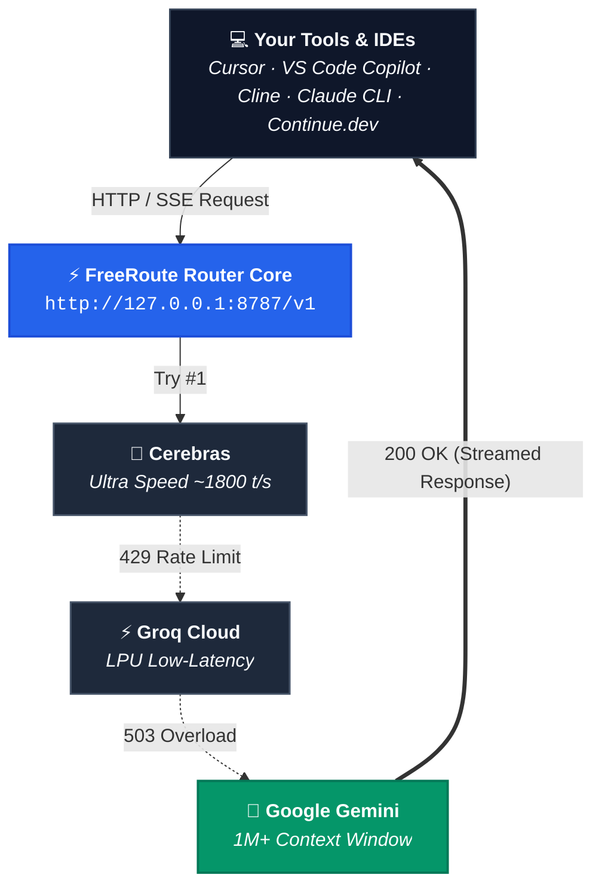

<div align="center">

# ⚡ FreeRoute

### **The Local-First, Zero-Dependency AI Router**
**Automated Multi-Provider Fallback · Encrypted Key Vault · 50+ Provider Presets · Real-time NOC Monitor · 100% Free Tiers First**

[](https://github.com/kayce310/FreeRoute)
[](https://www.typescriptlang.org/)
[](https://nodejs.org/)
[](https://github.com/kayce310/FreeRoute)
[](https://github.com/kayce310/FreeRoute)
[](./LICENSE)

<p align="center">
  <a href="./README.md"><b>English Documentation</b></a> · 
  <a href="./README.vi.md"><b>Tài Liệu Tiếng Việt</b></a> · 
  <a href="https://github.com/kayce310/FreeRoute/issues"><b>Report Issue / Feedback</b></a>
</p>

</div>



---

## 🚀 Why FreeRoute?

Most AI developers rely on a patchwork of free tiers (Google AI Studio, Groq, Cerebras, OpenRouter, GitHub Models, SiliconFlow, Mistral, HuggingFace, etc.) to power IDE copilots and agentic workflows. When one provider hits a rate limit (`429`), undergoes maintenance (`503`), or runs out of tokens, **your workflow halts**.

**FreeRoute eliminates this friction.** It sits transparently between your tools and AI providers as a single, local OpenAI- and Anthropic-compatible endpoint. It intelligently cascades requests across healthy providers, switches models on context overflow, protects your API keys in an isolated encrypted vault, and costs **$0** to run.

---

## ✨ Core Features

| Feature | Description |
| :--- | :--- |
| **🏎️ Zero Runtime Dependencies** | Built 100% on native Node.js core modules (`node:sqlite`, `node:crypto`, `node:http`). Starts in **< 40ms**, consumes **< 45MB RAM**, and has zero npm supply-chain vulnerabilities. |
| **🔀 Smart Fallback Cascades** | Instant multi-hop failover on `429 Rate Limit`, `5xx Server Error`, or quota exhaustion. Preserves streaming responses (`text/event-stream`) without disconnection. |
| **🔄 Context-Overflow Auto-Recovery** | Automatically detects context window overflow errors and switches to larger-context models (e.g., Gemini 1M+) seamlessly. |
| **⏱️ Stepped Backoff Cooldown** | Progressive cooldown (`<3 fails` = 15-30s, `3` = 5m, `4` = 30m, `5` = 1h, `6+` = 3h ceiling) prevents hammering exhausted endpoints, automatically resetting upon success. |
| **🔀 Custom Fallback Combos** | Create your own resilient model chains (e.g., `combo:free-coders`, `combo:speed-demons`) directly in the Web Dashboard or via API. |
| **⚡ 1-Click Key Sync & Discovery** | Automatically detects and imports existing API keys from local **9router** and **OmniRoute** databases without duplicates or re-prompting. |
| **🛡️ AES-256-GCM Vault & Git Security** | Credentials stored locally in `data/freeroute.sqlite` encrypted at rest. Git hygiene (`.gitignore`) guarantees no API keys or backup JSONs are ever pushed to GitHub. |
| **💾 JSON Key Backup & Restore** | 1-click export/import of stored credentials via the Dashboard or terminal CLI (`npm run backup:keys` / `npm run restore:keys`). |
| **🔄 1-Command Terminal Updates** | Upgrade to the latest release in seconds (`npm run update` or `freeroute update`), automatically pulling commits, updating packages, and rebuilding code without data loss. |
| **🪙 Token Usage & Live Estimator** | Real-time tracking and aggregation of prompt and completion tokens per provider and model, complete with token metrics on the dashboard. |
| **📡 Real-Time NOC & Timeline Stream** | Monitor provider health, latency percentiles (P50/P90), and live request history with chronological timeline auto-scroll and status badges. |
| **🧪 Vertical Streaming Playground** | Test prompts with real-time SSE streaming, live Time to First Token (TTFT) counter, total duration, and syntax copying. |
| **🌐 50+ Curated Provider Presets** | Instant configuration for OpenRouter, Groq, Gemini, Cerebras, GitHub Models, Kiro, Antigravity, Cline, SiliconFlow, Cohere, Ollama, and more. |
| **🌍 Full Bilingual Support** | 1-click switch between **Tiếng Việt** and **English** across the entire UI. |

---

## ⚡ 5-Minute Quick Start

### 1. Prerequisites
- **Node.js 22+** (supports native `node:sqlite`).

### 2. Clone & Install
```bash
git clone https://github.com/kayce310/FreeRoute.git
cd FreeRoute
npm install
npm run build
```

### 3. Launch FreeRoute
```bash
# Starts the server on http://127.0.0.1:8787
npm start
```

### 4. Configure Your Keys (Web Dashboard)
Open your browser at **[http://127.0.0.1:8787](http://127.0.0.1:8787)**:
- Click **`⚡ Import From 9router & OmniRoute`** to automatically import your existing keys.
- Or navigate to **Tab 5: API Key Management** to add keys manually.
- Or click **`📥 Export Backup JSON`** / **`📤 Import from JSON`** to migrate keys between machines.

---

## 💻 CLI & Terminal Operations

FreeRoute provides a comprehensive command-line interface for headless servers and automation:

```bash
# === Server Operations ===
npm start                               # Build and start server (http://127.0.0.1:8787)
freeroute serve                         # Start server directly via CLI binary
freeroute status                        # Inspect server status, data dir, and active providers

# === Update FreeRoute ===
npm run update                          # Pull git origin main, install deps, and rebuild
freeroute update                        # CLI alias for 1-command update

# === Key Management ===
freeroute add-key <provider> <api-key>  # Store an API key securely (AES-256-GCM)
freeroute list-keys                     # List configured providers (keys masked)
freeroute remove-key <provider> [id]    # Remove a stored credential
freeroute key-validate <provider> [id]  # Test live connectivity of a key against provider

# === Backup & Restore ===
npm run backup:keys                     # Export all keys to freeroute-keys-backup-YYYY-MM-DD.json
freeroute export-keys [path.json]       # Export keys to custom file path
npm run restore:keys <path.json>        # Restore keys from backup file
freeroute import-keys <path.json>       # Import keys via CLI

# === Import from 9router Database ===
npm run import:9router <path-to-db>     # Direct import from local 9router data.sqlite

# === Catalog, Preferences & Custom Providers ===
freeroute refresh                       # Force refresh model catalog from all providers
freeroute provider-add <id> <type> <url># Register a custom OpenAI/Gemini provider
freeroute provider-list                 # List custom providers
freeroute provider-remove <id>          # Delete a custom provider
```

---

## 🔀 Smart Fallback Combos & Profiles

Instead of hardcoding a single fragile model into your IDE, point your tools to a **FreeRoute Combo** or **Auto Profile**:

### Built-in Auto Profiles
| Profile Model ID | Description | Best For |
| :--- | :--- | :--- |
| `auto:free` | Prioritizes verified zero-cost models across healthy providers. | General conversation, drafting, translation. |
| `auto:code` | Prioritizes models with tool-calling and code synthesis capabilities. | Coding agents, Cursor, VS Code, Cline. |
| `auto:fast` | Prioritizes ultra-low latency providers (Cerebras, Groq). | Autocomplete, rapid brainstorming, quick edits. |
| `auto:long-context` | Prioritizes large context windows (Google Gemini 1M+). | Deep codebase analysis, large document summaries. |

### Pre-configured Custom Combos
| Combo ID | Fallback Chain | Description |
| :--- | :--- | :--- |
| `combo:free-coders` | `gemini/gemini-2.5-flash` ➔ `groq/qwen/qwen3.8-27b` ➔ `openrouter/...:free` | Rock-solid coding fallback chain with tool calling. |
| `combo:speed-demons` | `cerebras/llama-3.3-70b` ➔ `groq/llama-3.1-8b-instant` | Instantaneous response generation (500–1800 tok/s). |
| `combo:smart-chat` | `gemini/gemini-2.5-flash` ➔ `openrouter/...:free` ➔ `groq/...` | Smart reasoning with 1M context fallback. |

> **Custom Combos**: You can build, test, re-order, and save your own combos anytime in **Tab 4: Custom Combos** on the Dashboard or via the `/v1/combos` API.

---

## 🛠️ IDE & Agent Setup Guide

FreeRoute is drop-in compatible with standard OpenAI and Anthropic API formats:

### 1. Cursor IDE
1. Open **Settings** ➔ **Models** ➔ **OpenAI API Key**.
2. Override **OpenAI Base URL**: `http://127.0.0.1:8787/v1`
3. Enter any string as API Key (or your `FREEROUTE_API_TOKEN` if set in `.env`).
4. Add model: `combo:free-coders` or `auto:code`.

### 2. VS Code GitHub Copilot Custom Endpoint
In your VS Code `settings.json`:
```json
{
  "github.copilot.chat.customEndpoints": [
    {
      "name": "FreeRoute",
      "vendor": "customendpoint",
      "apiKey": "freeroute-local",
      "apiType": "chat-completions",
      "models": [
        {
          "id": "combo:free-coders",
          "name": "FreeRoute Free Coders",
          "url": "http://127.0.0.1:8787/v1",
          "toolCalling": true,
          "vision": true,
          "maxInputTokens": 1000000,
          "maxOutputTokens": 16000
        }
      ]
    }
  ]
}
```

### 3. Cline / Roo Code
1. API Provider: `OpenAI Compatible`
2. Base URL: `http://127.0.0.1:8787/v1`
3. API Key: `freeroute-local` (or your configured token)
4. Model ID: `combo:free-coders` or `auto:code`

### 4. Claude Code CLI
```bash
export ANTHROPIC_BASE_URL="http://127.0.0.1:8787"
export ANTHROPIC_API_KEY="freeroute-local"
claude --model auto:free
```

### 5. Continue.dev
In `~/.continue/config.json`:
```json
{
  "models": [
    {
      "title": "FreeRoute Coding Chain",
      "provider": "openai",
      "model": "combo:free-coders",
      "apiBase": "http://127.0.0.1:8787/v1",
      "apiKey": "freeroute-local"
    }
  ]
}
```

---

## 🌐 Curated Provider Directory (50+ Presets)

FreeRoute includes 50+ preconfigured presets organized into tiers:

| Tier | Providers | Highlights & Portals |
| :--- | :--- | :--- |
| **🎁 Free Tier** | Google Gemini, Groq, Cerebras, OpenRouter, GitHub Models, Mistral AI, SiliconFlow, Cohere, Hugging Face, SambaNova, Hyperbolic, NVIDIA NIM, Cloudflare AI, Antigravity, Blackbox, OpenCode, API Airforce | High-speed inference, `:free` models, 1M+ context windows. [Get Gemini Key](https://aistudio.google.com/app/apikey) · [Get Groq Key](https://console.groq.com/keys) · [Get Cerebras Key](https://cloud.cerebras.ai/platform) · [Get OpenRouter Key](https://openrouter.ai/keys) |
| **💎 Freemium** | Kiro AI, Cline AI, Kimi Coding, AliCode, DeepInfra, Together AI, Fireworks AI, Lepton AI, Novita AI, Arcee AI, Bytez | Free starter credits or generous daily quotas. |
| **💻 Local / Offline** | Ollama, LM Studio, vLLM | 100% private, offline inference on `127.0.0.1`. |
| **🏢 Commercial** | OpenAI, Anthropic, DeepSeek, xAI (Grok), Perplexity, Moonshot, Zhipu GLM, DashScope, MiniMax, BytePlus, Baichuan, 01.AI, StepFun, Replicate, AI21, Azure OpenAI, AWS Bedrock, Upstage, AiHubMix | Enterprise endpoints for fallback when free tiers are exhausted. |

---

## 📡 API Endpoints Reference

| Method | Endpoint | Auth | Purpose |
| :--- | :--- | :--- | :--- |
| `GET` | `/` | Public | Web Dashboard (HTML/CSS/JS) |
| `GET` | `/health` | Public | System health check (`{ status: "ok" }`) |
| `GET` | `/v1/auth/status` | Public | Setup status, key counts, configured providers |
| `GET` | `/v1/providers/presets` | Public | List 50+ curated provider presets & seed models |
| `GET` | `/v1/import/sources` | Public | Auto-detect local 9router & OmniRoute databases |
| `POST`| `/v1/import/sync` | Bearer* | 1-Click sync discovered keys into vault |
| `GET` | `/v1/credentials/export` | Bearer* | Download decrypted JSON key backup |
| `POST`| `/v1/credentials/import` | Bearer* | Restore API keys from JSON backup |
| `GET` | `/v1/credentials` | Bearer* | List credential metadata (secrets masked) |
| `POST`| `/v1/credentials` | Bearer* | Store/update provider API key |
| `DELETE`| `/v1/credentials` | Bearer* | Remove stored credential |
| `GET` | `/v1/combos` | Bearer* | List custom fallback combos |
| `POST`| `/v1/combos` | Bearer* | Create or update a custom combo |
| `DELETE`| `/v1/combos/:id` | Bearer* | Delete a custom combo |
| `GET` | `/v1/providers/custom` | Bearer* | List user-defined custom providers |
| `POST`| `/v1/providers/custom` | Bearer* | Add a custom OpenAI/Gemini provider |
| `DELETE`| `/v1/providers/custom` | Bearer* | Remove a custom provider |
| `GET` | `/v1/preferences` | Bearer* | List model routing preferences (`prefer`/`block`) |
| `PUT` | `/v1/preferences` | Bearer* | Update preference for a specific model |
| `GET` | `/v1/stats/tokens` | Bearer* | Aggregate prompt/completion token consumption |
| `GET` | `/v1/quota-observations`| Bearer* | Observed provider quota headers and capacity |
| `GET` | `/v1/routing-events` | Bearer* | Redacted routing audit events stream |
| `GET` | `/v1/provider-health` | Bearer* | Latency percentiles (P50/P90) & success rates |
| `GET` | `/v1/models` | Bearer* | OpenAI-compatible model catalog |
| `POST`| `/v1/chat/completions` | Bearer* | OpenAI Chat API (streaming & non-streaming) |
| `POST`| `/v1/responses` | Bearer* | OpenAI Responses API |
| `POST`| `/v1/messages` | Bearer* | Anthropic Messages API |

*\*Note: Bearer token is optional unless `FREEROUTE_API_TOKEN` is defined in `.env`.*

---

## 📊 Comparison Matrix

| Capability | FreeRoute | 9router | OmniRoute | LiteLLM |
| :--- | :---: | :---: | :---: | :---: |
| **Core Focus** | **Free Tiers & Smart Fallback** | Multi-account proxy | Enterprise proxy | Universal Python gateway |
| **Runtime Dependencies** | **0 (Zero npm dependencies)** | ~25+ npm packages | ~40+ npm packages | 50+ pip packages |
| **Startup Time / RAM** | **< 40ms / ~40MB** | ~1.2s / ~140MB | ~2.5s / ~220MB | ~1.8s / ~180MB |
| **1-Click Local Key Sync** | **✅ (9router + OmniRoute)** | ❌ No | ❌ No | ❌ No |
| **Context-Overflow Failover** | **✅ Automatic** | ❌ Fails request | ❌ Fails request | ⚠️ Config needed |
| **Progressive Stepped Backoff** | **✅ (15s ➔ 5m ➔ 30m ➔ 1h ➔ 3h)** | ⚠️ Fixed timer | ⚠️ Fixed timer | ⚠️ Static cooldown |
| **Custom Fallback Combos** | **✅ Full UI & API** | ❌ No | ⚠️ Config file | ⚠️ YAML config |
| **JSON Key Backup / Restore** | **✅ Web UI & CLI** | ❌ No | ❌ No | ❌ No |
| **1-Command Terminal Update** | **✅ `npm run update`** | ✅ Script | ❌ No | ⚠️ pip install -U |
| **Interactive Test Playground** | **✅ Vertical SSE with TTFT** | ❌ No | ⚠️ Basic | ⚠️ Basic |
| **Token Usage Analytics** | **✅ Per-provider & model** | ⚠️ Basic | ⚠️ Basic | ✅ Yes |
| **Security Architecture** | **AES-256-GCM + Isolated DB** | Plaintext / AES | AES-256-CBC | Environment / DB |

---

## 🛡️ Security & Privacy Guarantees

1. **Local-First & Offline-Bound**: FreeRoute binds strictly to `127.0.0.1:8787`. It never listens on public interfaces without explicit user configuration.
2. **Zero Telemetry Leakage**: Client-specific telemetry headers (`x-cursor-*`, `cf-ray`, internal session tokens) are stripped prior to upstream forwarding.
3. **No Prompt Storage**: Only anonymized routing events (timestamp, model ID, latency, HTTP status code, token counts) are retained for health metrics. Your prompts and code never touch persistent storage.
4. **Git Isolation**: The database directory `data/` and all backup files (`*backup*.json`) are hard-ignored in `.gitignore`. Your repository remains 100% clean and safe to push to GitHub.

---

## 📄 License

This project is licensed under the **MIT License** — see the [LICENSE](./LICENSE) file for details.
