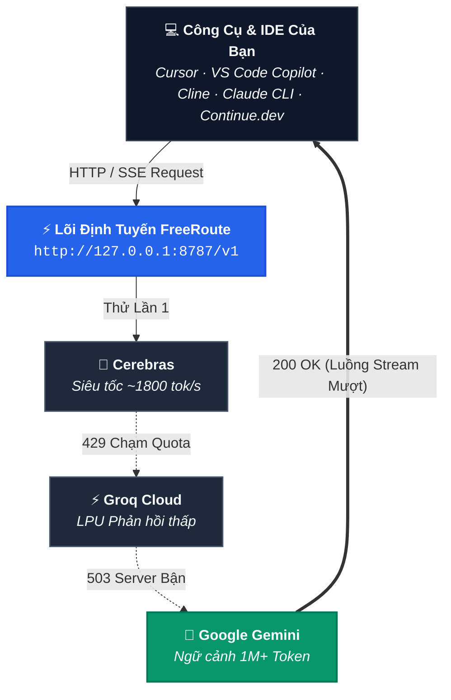

<div align="center">

# ⚡ FreeRoute

### **Cổng Điều Hướng AI Thông Minh · 0 Thư Viện Phụ Thuộc · Local-First**
**Tự Động Fallback Cứu Nguy · Két Khóa Mã Hóa AES-256-GCM · Hơn 50+ Nhà Cung Cấp · Giám Sát NOC Thời Gian Thực · Ưu Tiên 100% Miễn Phí**

[](https://github.com/kayce310/FreeRoute)
[](https://www.typescriptlang.org/)
[](https://nodejs.org/)
[](https://github.com/kayce310/FreeRoute)
[](https://github.com/kayce310/FreeRoute)
[](./LICENSE)

<p align="center">
  <a href="./README.md"><b>Tài Liệu Tiếng Anh</b></a> · 
  <a href="./README.vi.md"><b>Tài Liệu Tiếng Việt</b></a> · 
  <a href="https://github.com/kayce310/FreeRoute/issues"><b>Báo Lỗi / Góp Ý</b></a>
</p>

</div>



---

## 🚀 Vì Sao Bạn Cần FreeRoute?

Các lập trình viên thường kết hợp nhiều gói miễn phí (Google AI Studio, Groq, Cerebras, OpenRouter, GitHub Models, SiliconFlow, Mistral, HuggingFace...) để lập trình trên Cursor, VS Code Copilot, Cline. Nhưng khi một nhà cung cấp bị chạm giới hạn tần suất (`429 Rate Limit`), gặp sự cố bảo trì (`503`), hoặc hết hạn mức trong ngày, **công việc của bạn ngay lập tức bị gián đoạn**.

**FreeRoute giải quyết dứt điểm vấn đề này.** Hệ thống hoạt động như một cổng tương thích OpenAI & Anthropic nội bộ duy nhất trên máy bạn: tự động chuyển vùng dự phòng khi có lỗi, tự đổi model khi tràn ngữ cảnh, mã hóa an toàn toàn bộ khóa API và tiêu tốn **$0** chi phí vận hành.

---

## ✨ Điểm Nhấn Tính Năng Nổi Bật

| Tính Năng | Chi Tiết |
| :--- | :--- |
| **🏎️ 0 Thư Viện Phụ Thuộc (Zero Dependencies)** | Xây dựng 100% bằng các module chuẩn của Node.js (`node:sqlite`, `node:crypto`, `node:http`). Khởi động trong **< 40ms**, tiêu thụ **< 45MB RAM**, hoàn toàn không có nguy cơ mã độc từ npm supply chain. |
| **🔀 Fallback Chuyển Vùng Đa Tầng** | Tự động chuyển vùng mượt mà khi gặp lỗi `429 Rate Limit`, `5xx Server Error`, hoặc hết hạn mức. Không làm đứt đoạn luồng streaming phản hồi (`text/event-stream`). |
| **🔄 Tự Động Xử Lý Tràn Ngữ Cảnh (Context Overflow)** | Tự động nhận diện prompt dài vượt khung context window và chuyển tiếp sang model có ngữ cảnh siêu lớn (Gemini 1M+) hoàn toàn tự động. |
| **⏱️ Cooldown Lũy Tiến Thông Minh** | Cơ chế phạt thông minh (`< 3 lần` = 15-30s, `3` = 5 phút, `4` = 30 phút, `5` = 1 giờ, `6+` = tối đa 3 giờ) tránh gửi dồn dập vào endpoint kiệt quệ, tự động reset về 0 ngay khi request thành công. |
| **🔀 Chuỗi Fallback Tùy Biến (Custom Combos)** | Tự thiết lập chuỗi model theo ý muốn (ví dụ `combo:free-coders`, `combo:speed-demons`) trực tiếp từ Dashboard hoặc qua API. |
| **⚡ Đồng Bộ Khóa 1-Click Không Trùng Lặp** | Tự động quét và giải mã database của **9router** và **OmniRoute** trên máy cá nhân, nạp an toàn không trùng lặp và không yêu cầu nhập lại key. |
| **🛡️ Két Khóa AES-256-GCM & Bảo Mật Git** | Khóa API được lưu độc lập tại `data/freeroute.sqlite` mã hóa AES-256-GCM. Quy tắc `.gitignore` nghiêm ngặt đảm bảo key và file backup không bao giờ bị đẩy lên GitHub. |
| **💾 Xuất & Nhập File JSON Backup Khóa** | Xuất/nhập toàn bộ API key chỉ với 1 click trên Web Dashboard hoặc qua lệnh terminal (`npm run backup:keys` / `npm run restore:keys`). |
| **🔄 1 Lệnh Cập Nhật Terminal Tự Động** | Nâng cấp FreeRoute lên bản mới nhất bằng 1 lệnh duy nhất (`npm run update` hoặc `freeroute update`), tự kéo git, cài đặt và build lại mã nguồn mà không mất dữ liệu. |
| **🪙 Đo Lường & Theo Dõi Token Thực Tế** | Tích hợp bộ đếm token ước lượng cho cả prompt và completion, tổng hợp chi tiết theo từng provider và hiển thị trực tiếp trên Dashboard. |
| **📡 Giám Sát Sức Khỏe & Routing Stream** | Theo dõi ma trận sức khỏe nhà cung cấp (độ trễ P50/P90, tỷ lệ thành công) và bảng log định tuyến thời gian thực tự động cuộn theo timeline. |
| **🧪 Test Playground Định Dạng Dọc** | Khu vực thử nghiệm chuyên nghiệp với console streaming dọc hiển thị từng token thời gian thực, đo tốc độ token đầu tiên (TTFT) và tổng thời gian phản hồi. |
| **🌐 Hơn 50+ Nhà Cung Cấp Có Sẵn** | Tích hợp sẵn mẫu kết nối cho OpenRouter, Groq, Gemini, Cerebras, GitHub Models, Kiro, Antigravity, Cline, SiliconFlow, Cohere, Ollama... |
| **🌍 Song Ngữ Toàn Diện** | Chuyển đổi ngôn ngữ tức thì giữa **Tiếng Việt** và **English** chỉ với 1 cú click chuột. |

---

## ⚡ Bắt Đầu Nhanh Trong 5 Phút

### 1. Yêu Cầu Môi Trường
- **Node.js phiên bản 22 trở lên** (hỗ trợ module `node:sqlite` tích hợp sẵn).

### 2. Clone Dự Án & Cài Đặt
```bash
git clone https://github.com/kayce310/FreeRoute.git
cd FreeRoute
npm install
npm run build
```

### 3. Khởi Chạy FreeRoute
```bash
# Khởi chạy server tại http://127.0.0.1:8787
npm start
```

### 4. Thiết Lập Khóa API (Giao Diện Web)
Mở trình duyệt truy cập: **[http://127.0.0.1:8787](http://127.0.0.1:8787)**:
- Nhấn **`⚡ Nhập Từ 9router & OmniRoute`** để nạp tự động các khóa có sẵn trên máy.
- Hoặc vào **Tab 5: Quản Lý API Key** để thêm khóa thủ công.
- Hoặc dùng nút **`📥 Xuất Backup JSON`** / **`📤 Nhập từ JSON`** để chuyển khóa giữa các máy.

---

## 💻 Danh Mục Lệnh Terminal & CLI

```bash
# === Vận Hành Máy Chủ ===
npm start                               # Build và khởi chạy server (http://127.0.0.1:8787)
freeroute serve                         # Khởi chạy server trực tiếp bằng lệnh CLI
freeroute status                        # Xem trạng thái máy chủ, thư mục data, danh sách provider

# === Cập Nhật Phiên Bản (Chuẩn 1 Lệnh) ===
npm run update                          # Tự động git pull, npm install và rebuild
freeroute update                        # Lệnh rút gọn qua CLI

# === Quản Lý Khóa API ===
freeroute add-key <provider> <api-key>  # Lưu thêm khóa API an toàn (mã hóa AES-256-GCM)
freeroute list-keys                     # Xem danh sách các khóa đã lưu (ẩn secret)
freeroute remove-key <provider> [id]    # Xóa bớt khóa
freeroute key-validate <provider> [id]  # Kiểm tra kết nối thực tế của khóa

# === Sao Lưu & Khôi Phục Khóa ===
npm run backup:keys                     # Xuất khóa ra file freeroute-keys-backup-YYYY-MM-DD.json
freeroute export-keys [path.json]       # Xuất khóa ra đường dẫn tùy chọn
npm run restore:keys <path.json>        # Khôi phục khóa từ file JSON
freeroute import-keys <path.json>       # Nhập khóa qua CLI

# === Nhập Trực Tiếp Từ 9router ===
npm run import:9router <path-to-db>     # Nhập key trực tiếp từ file data.sqlite của 9router

# === Quản Lý Danh Mục & Nhà Cung Cấp Tùy Chỉnh ===
freeroute refresh                       # Quét làm mới lại danh mục model từ nhà cung cấp
freeroute provider-add <id> <type> <url># Thêm endpoint OpenAI/Gemini tùy chỉnh
freeroute provider-list                 # Xem danh sách provider tùy chỉnh
freeroute provider-remove <id>          # Xóa provider tùy chỉnh
```

---

## 🔀 Hồ Sơ Tự Động & Chuỗi Custom Combos

Thay vì cố định một model duy nhất dễ gặp lỗi, hãy trỏ công cụ của bạn vào các **Hồ Sơ Tự Động** hoặc **Combo Dự Phòng**:

### Các Hồ Sơ Tự Động (Auto Profiles)
| ID Model Yêu Cầu | Ý Nghĩa Hoạt Động | Phù Hợp Cho |
| :--- | :--- | :--- |
| `auto:free` | Tự động chọn các model 100% miễn phí tốt nhất trên các provider khỏe mạnh. | Trò chuyện, viết lách, dịch thuật thông thường. |
| `auto:code` | Ưu tiên model hỗ trợ gọi công cụ (tool-calling) và sinh code. | Trợ lý lập trình, Cursor, VS Code, Cline. |
| `auto:fast` | Ưu tiên các nhà cung cấp siêu tốc (Cerebras, Groq). | Gợi ý code nhanh, sửa lỗi ngắn, brainstorming. |
| `auto:long-context` | Ưu tiên model có ngữ cảnh siêu lớn (Gemini 1M+). | Phân tích toàn bộ codebase, đọc tài liệu dày. |

### Các Combo Dự Phòng Mẫu
| ID Combo | Chuỗi Chuyển Vùng Fallback | Ý Nghĩa |
| :--- | :--- | :--- |
| `combo:free-coders` | `gemini/gemini-2.5-flash` ➔ `groq/qwen/qwen3.8-27b` ➔ `openrouter/...:free` | Chuỗi lập trình bền vững kèm hỗ trợ tool-calling. |
| `combo:speed-demons` | `cerebras/llama-3.3-70b` ➔ `groq/llama-3.1-8b-instant` | Phản hồi siêu tốc độ (500–1800 tok/s). |
| `combo:smart-chat` | `gemini/gemini-2.5-flash` ➔ `openrouter/...:free` ➔ `groq/...` | Suy luận thông minh kèm fallback ngữ cảnh 1M. |

> **Custom Combos**: Bạn có thể tạo, chỉnh sửa thứ tự ưu tiên và lưu các combo mới bất kỳ lúc nào tại **Tab 4: Custom Combos** trên Dashboard hoặc qua API `/v1/combos`.

---

## 🛠️ Hướng Dẫn Cấu Hình IDE & Công Cụ

### 1. Cursor IDE
1. Vào **Settings** ➔ **Models** ➔ **OpenAI API Key**.
2. Điền **OpenAI Base URL**: `http://127.0.0.1:8787/v1`
3. Ô API Key: Nhập bất kỳ ký tự nào (hoặc token `FREEROUTE_API_TOKEN` nếu cài đặt).
4. Thêm model: `combo:free-coders` hoặc `auto:code`.

### 2. VS Code GitHub Copilot Custom Endpoint
Thêm vào file `settings.json` của VS Code:
```json
{
  "github.copilot.chat.customEndpoints": [
    {
      "name": "FreeRoute",
      "vendor": "customendpoint",
      "apiKey": "freeroute-local",
      "apiType": "chat-completions",
      "models": [
        {
          "id": "combo:free-coders",
          "name": "FreeRoute Free Coders",
          "url": "http://127.0.0.1:8787/v1",
          "toolCalling": true,
          "vision": true,
          "maxInputTokens": 1000000,
          "maxOutputTokens": 16000
        }
      ]
    }
  ]
}
```

### 3. Cline / Roo Code
1. API Provider: Chọn `OpenAI Compatible`
2. Base URL: `http://127.0.0.1:8787/v1`
3. API Key: `freeroute-local` (hoặc token cấu hình của bạn)
4. Model ID: `combo:free-coders` hoặc `auto:code`

### 4. Claude Code CLI
```bash
export ANTHROPIC_BASE_URL="http://127.0.0.1:8787"
export ANTHROPIC_API_KEY="freeroute-local"
claude --model auto:free
```

### 5. Continue.dev
Trong file `~/.continue/config.json`:
```json
{
  "models": [
    {
      "title": "FreeRoute Coding Chain",
      "provider": "openai",
      "model": "combo:free-coders",
      "apiBase": "http://127.0.0.1:8787/v1",
      "apiKey": "freeroute-local"
    }
  ]
}
```

---

## 🌐 Danh Mục 50+ Nhà Cung Cấp Hỗ Trợ

| Phân Nhóm | Các Nhà Cung Cấp | Điểm Nổi Bật & Cổng Đăng Ký |
| :--- | :--- | :--- |
| **🎁 Miễn Phí (Free Tier)** | Google Gemini, Groq, Cerebras, OpenRouter, GitHub Models, Mistral AI, SiliconFlow, Cohere, Hugging Face, SambaNova, Hyperbolic, NVIDIA NIM, Cloudflare AI, Antigravity, Blackbox, OpenCode, API Airforce | Tốc độ cực cao, các model `:free`, ngữ cảnh 1M+. [Lấy Key Gemini](https://aistudio.google.com/app/apikey) · [Lấy Key Groq](https://console.groq.com/keys) · [Lấy Key Cerebras](https://cloud.cerebras.ai/platform) · [Lấy Key OpenRouter](https://openrouter.ai/keys) |
| **💎 Freemium (Gói Tặng)** | Kiro AI, Cline AI, Kimi Coding, AliCode, DeepInfra, Together AI, Fireworks AI, Lepton AI, Novita AI, Arcee AI, Bytez | Tặng credit khởi tạo hoặc quota miễn phí định kỳ. |
| **💻 Local / Ngoại Tuyến** | Ollama, LM Studio, vLLM | Chạy cục bộ 100% riêng tư không cần Internet trên `127.0.0.1`. |
| **🏢 Thương Mại (Commercial)** | OpenAI, Anthropic, DeepSeek, xAI (Grok), Perplexity, Moonshot, Zhipu GLM, DashScope, MiniMax, BytePlus, Baichuan, 01.AI, StepFun, Replicate, AI21, Azure OpenAI, AWS Bedrock, Upstage, AiHubMix | Dùng làm trạm dự phòng cuối cùng khi toàn bộ gói miễn phí kiệt quệ. |

---

## 📡 Danh Mục API Endpoints

| Phương Thức | Endpoint | Xác Thực | Mục Đích |
| :--- | :--- | :--- | :--- |
| `GET` | `/` | Công khai | Giao diện Dashboard (HTML/CSS/JS) |
| `GET` | `/health` | Công khai | Kiểm tra tình trạng máy chủ (`{ status: "ok" }`) |
| `GET` | `/v1/auth/status` | Công khai | Trạng thái thiết lập, số lượng key, provider sẵn sàng |
| `GET` | `/v1/providers/presets` | Công khai | Lấy danh sách 50+ preset nhà cung cấp |
| `GET` | `/v1/import/sources` | Công khai | Tự động dò tìm database 9router & OmniRoute |
| `POST`| `/v1/import/sync` | Bearer* | Đồng bộ 1-click các key tìm được vào két lưu trữ |
| `GET` | `/v1/credentials/export` | Bearer* | Xuất file JSON sao lưu các khóa API |
| `POST`| `/v1/credentials/import` | Bearer* | Nhập khóa API từ file JSON sao lưu |
| `GET` | `/v1/credentials` | Bearer* | Lấy danh sách siêu dữ liệu khóa đã lưu (ẩn secret) |
| `POST`| `/v1/credentials` | Bearer* | Lưu hoặc cập nhật khóa API |
| `DELETE`| `/v1/credentials` | Bearer* | Xóa khóa đã lưu |
| `GET` | `/v1/combos` | Bearer* | Lấy danh sách chuỗi fallback tùy biến |
| `POST`| `/v1/combos` | Bearer* | Tạo hoặc cập nhật combo tùy biến |
| `DELETE`| `/v1/combos/:id` | Bearer* | Xóa combo tùy biến |
| `GET` | `/v1/providers/custom` | Bearer* | Danh sách các provider tự thêm |
| `POST`| `/v1/providers/custom` | Bearer* | Thêm mới provider tùy chỉnh |
| `DELETE`| `/v1/providers/custom` | Bearer* | Xóa provider tùy chỉnh |
| `GET` | `/v1/preferences` | Bearer* | Xem danh sách tùy chọn ưu tiên/chặn model |
| `PUT` | `/v1/preferences` | Bearer* | Cập nhật tùy chọn model (`prefer`/`block`/`default`) |
| `GET` | `/v1/stats/tokens` | Bearer* | Thống kê số lượng token tiêu thụ theo từng provider |
| `GET` | `/v1/quota-observations`| Bearer* | Dữ liệu hạn ngạch quota ghi nhận được từ provider |
| `GET` | `/v1/routing-events` | Bearer* | Dòng log sự kiện định tuyến thời gian thực (ẩn danh) |
| `GET` | `/v1/provider-health` | Bearer* | Ma trận sức khỏe, độ trễ P50/P90 và tỷ lệ thành công |
| `GET` | `/v1/models` | Bearer* | Danh mục model theo định dạng OpenAI |
| `POST`| `/v1/chat/completions` | Bearer* | OpenAI Chat API (hỗ trợ cả stream SSE & non-stream) |
| `POST`| `/v1/responses` | Bearer* | OpenAI Responses API |
| `POST`| `/v1/messages` | Bearer* | Anthropic Messages API |

*\*Ghi chú: Token Bearer là tùy chọn nếu bạn không cấu hình `FREEROUTE_API_TOKEN` trong `.env`.*

---

## 🛡️ Cam Kết An Toàn & Bảo Mật

1. **Local-First & Khép Kín**: Mặc định lắng nghe duy nhất tại `127.0.0.1:8787`, không mở cổng ra mạng Internet công cộng nếu bạn không tự cấu hình.
2. **Khử Sạch Header Định Danh**: Loại bỏ toàn bộ các header đặc thù của client (`x-cursor-*`, `cf-ray`...) trước khi chuyển tiếp yêu cầu đến provider nhằm chống việc tài khoản bị khóa nhầm.
3. **Không Lưu Nội Dung Prompt**: Cơ sở dữ liệu SQLite chỉ lưu trữ siêu dữ liệu thống kê ẩn danh (thời gian, model, latency, mã HTTP status, số lượng token). Câu hỏi và mã nguồn của bạn không bao giờ bị lưu trên đĩa.
4. **Cô Lập Với Git**: Thư mục cơ sở dữ liệu `data/` và tất cả các file sao lưu (`*backup*.json`) được cấu hình trong `.gitignore`, đảm bảo an toàn tuyệt đối khi bạn đẩy code lên GitHub.

---

## 📄 Bản Quyền (License)

Dự án được phân phối dưới giấy phép mã nguồn mở **MIT License** — xem chi tiết tại file [LICENSE](./LICENSE).
